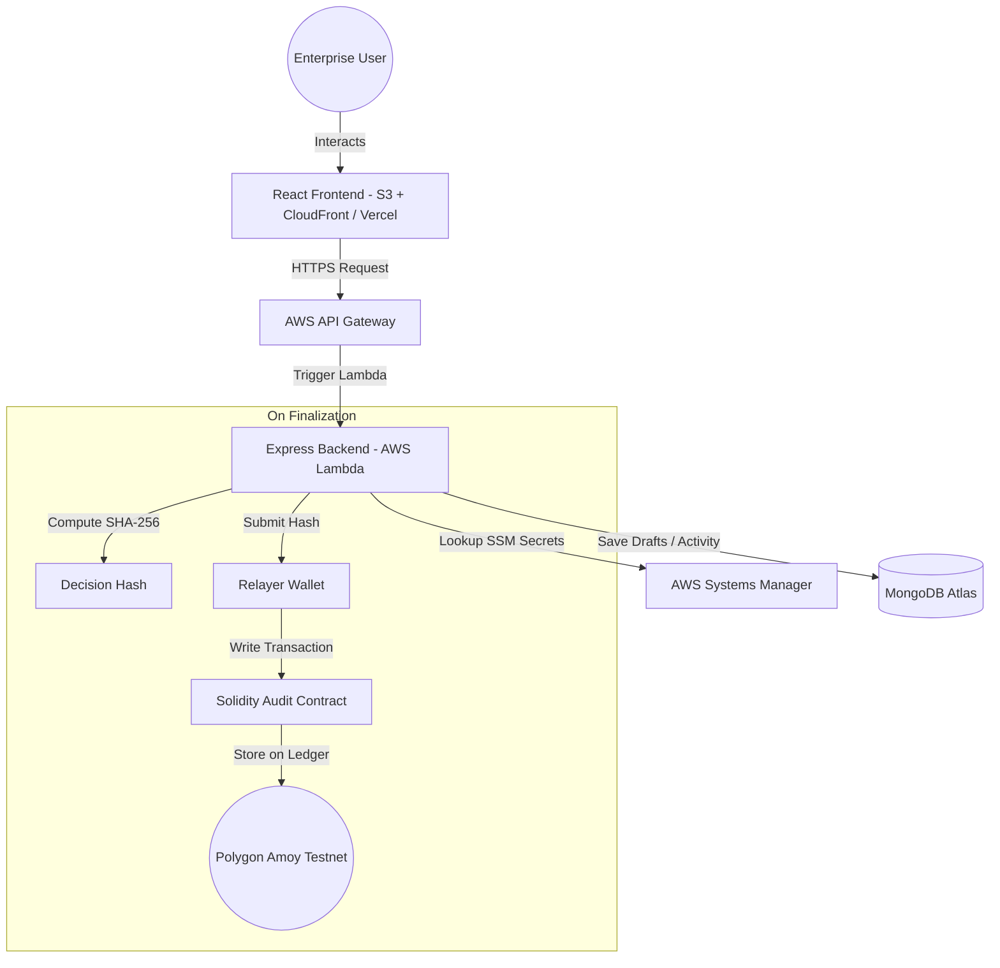

<h1 align="center">
  
  <br>
  DecisionLedger
</h1>

<p align="center">
  <strong>Enterprise Decision Infrastructure with Cryptographic Blockchain Anchoring</strong>
</p>

<p align="center">
  
  
  
  
  
  
  
</p>

---

## 📖 Overview

**DecisionLedger** is an enterprise-grade Decision-Support and Governance Infrastructure. It allows organizations to document strategic decisions, build consensus through decentralized voting, run strategic simulations, and archive finalized results. 

To guarantee total accountability and prevent internal tampering, DecisionLedger integrates a **hybrid dual-layer validation model**:
1. **Operational Database Layer:** High-speed, indexed MongoDB storage for active drafts, discussions, simulations, and user accounts.
2. **Immutable Cryptographic Audit Layer:** A Solidity smart contract deployed on the **Polygon Amoy Testnet** where cryptographic SHA-256 hashes of finalized decisions are anchored forever. Users can verify the data's absolute integrity in one click from the UI.

---

## 🛠️ Key Features

- **📊 Central Governance Dashboard:** Real-time metrics showing decision velocity, active proposals, consensus rates, and system entropy.
- **🗳️ Strategic Voting & Consensus:** Multi-option choice validation with graphical vote representation and weighted scoring.
- **🛡️ On-Chain Proof-of-Integrity:** Automatic background relayer that generates SHA-256 hashes of final records and submits audit logs to the blockchain.
- **🔍 Cryptographic Verification Portal:** In-app verification drawer checking the live database state directly against the Polygon nodes.
- **⚙️ Deep Enterprise Settings Panel:** Dedicated modules for Security, Teams, System Controls, Integrations, and AI Automation configurations.
- **🌗 Theme Control System:** Native Dark/Light mode toggles persisting settings globally across the workspace.

---

## 🏗️ System Architecture



---

## 📂 Project Structure

```bash
DecisionLedger/
├── frontend/                  # React (Vite + TailwindCSS + Framer Motion)
│   ├── src/
│   │   ├── auth/              # JWT Auth Context & Utilities
│   │   ├── components/        # Sidebar, Navbar, FluidCanvas, DashboardLayout
│   │   ├── contexts/          # Theme System Contexts
│   │   ├── features/          # Dashboard, Analytics, Timeline, Settings Modules
│   │   └── services/          # API Handlers
│   ├── vercel.json            # Vercel SPA Routing Configuration
│   └── vite.config.js
│
├── backend/                   # Node.js Serverless Backend (Express.js)
│   ├── contracts/             # Solidity Smart Contracts (DecisionLedgerAudit.sol)
│   ├── src/
│   │   ├── controllers/       # Business logic (blockchain anchoring, voting)
│   │   ├── middleware/        # JWT Authentication Guard
│   │   ├── models/            # Mongoose Schemas (User, Decision, Activity)
│   │   └── services/          # ethers.js Blockchain Service
│   ├── lambda.js              # AWS Lambda entry point (serverless-http)
│   ├── serverless.yml         # Serverless Framework deploy config
│   ├── deploy_frontend.cjs    # AWS S3 static sync automated script
│   └── upload_ssm.cjs         # Parameter Store secrets loader
```

---

## 🚀 Getting Started

### 📋 Prerequisites
- **Node.js:** v18.x or above (v20+ recommended)
- **MongoDB Atlas Connection URI**
- **Polygon Wallet Private Key** (With test POL tokens on Amoy Network)
- **AWS CLI** (configured locally if deploying to AWS S3/Lambda)
- **Vercel CLI** (if deploying to Vercel)

---

## ⚙️ Installation & Local Setup

### 1. Clone the Repository
```bash
git clone https://github.com/mr-vishwakarma/DecisionLedger.git
cd DecisionLedger
```

### 2. Configure Environment Variables
Create a `.env` file in the `backend/` directory:
```env
PORT=5000
MONGO_URI=your_mongodb_atlas_connection_string
JWT_SECRET=your_jwt_signature_secret
EMAIL_USER=your_smtp_sender_email
EMAIL_PASS=your_smtp_app_password
GOOGLE_CLIENT_ID=your_google_oauth_client_id
GOOGLE_CLIENT_SECRET=your_google_oauth_client_secret
POLYGON_RPC_URL=https://rpc-amoy.polygon.technology/
POLYGON_PRIVATE_KEY=your_polygon_wallet_private_key
```

Create a `.env` file in the `frontend/` directory:
```env
VITE_API_URL=http://localhost:5000
VITE_GOOGLE_CLIENT_ID=your_google_oauth_client_id
```

### 3. Install Dependencies & Launch Dev Servers

**Backend:**
```bash
cd backend
npm install
npm run dev
```

**Frontend:**
```bash
cd ../frontend
npm install
npm run dev
```

The application will be running locally at `http://localhost:5173`.

---

## 📦 Deployment Guides

### 🌐 Frontend Hosting (Vercel)
To deploy the frontend to Vercel simultaneously with the static AWS builds, navigate to the `frontend/` folder and run:
```bash
npx vercel --yes --scope ram-vishwakarmas-projects
```
Then, register your production variables on the Vercel CLI:
```bash
npx vercel env add VITE_API_URL production --value "https://o4s7w8wzh6.execute-api.us-east-1.amazonaws.com/dev" --scope ram-vishwakarmas-projects
npx vercel env add VITE_GOOGLE_CLIENT_ID production --value "your_production_google_id" --scope ram-vishwakarmas-projects
npx vercel --prod --yes --scope ram-vishwakarmas-projects
```

### ☁️ AWS Serverless Backend (SSM + Lambda)
Upload local environment secrets securely to AWS SSM Parameter Store:
```bash
node backend/upload_ssm.cjs
```
Deploy the API server handler to Lambda:
```bash
cd backend
.\node_modules\.bin\serverless deploy
```

---

## 📜 Smart Contract Specifications

The cryptographic anchoring uses a custom audit contract deployed on the Polygon Amoy Testnet at address:
**`0xF1d900de6aa6F8F9DB3D9174ce1a3e04f5D33a64`**

### Audit Interface:
```solidity
// SPDX-License-Identifier: MIT
pragma solidity ^0.8.20;

contract DecisionLedgerAudit {
    address public owner;

    struct AuditRecord {
        bytes32 decisionHash;
        uint256 timestamp;
        string metadata;
    }

    mapping(string => AuditRecord) private records;

    event DecisionAnchored(string indexed decisionId, bytes32 indexed decisionHash, uint256 timestamp);

    constructor() { owner = msg.sender; }

    function anchorDecision(string calldata decisionId, bytes32 decisionHash, string calldata metadata) external {
        require(msg.sender == owner, "Only relayer can anchor decisions");
        records[decisionId] = AuditRecord(decisionHash, block.timestamp, metadata);
        emit DecisionAnchored(decisionId, decisionHash, block.timestamp);
    }

    function verifyDecision(string calldata decisionId) external view returns (bytes32 decisionHash, uint256 timestamp, string memory metadata) {
        AuditRecord memory record = records[decisionId];
        return (record.decisionHash, record.timestamp, record.metadata);
    }
}
```

---

## 🔒 Security & Compliance
- **AWS SSM Key Encryption:** All credentials are encrypted as `SecureString` types at rest.
- **Relayer Access Restrictions:** The blockchain ledger only accepts write transactions signed by the designated relayer private key.
- **Data Protection:** The `.gitignore` config explicitly isolates all local development `.env` configurations from version control pipelines.

---

## 👥 Contributors
- **Ram Vishwakarma** - *Lead Architect & Engineer*
- **Antigravity AI** - *Engineering Pair Programmer*
